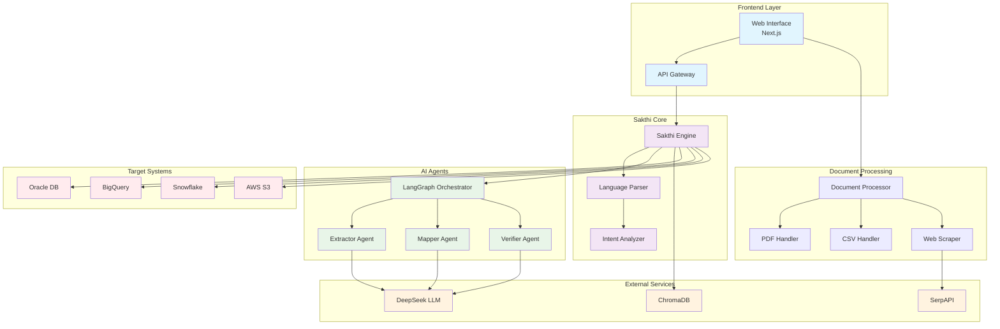

# 🚀 Sakthi Platform - AI-Powered Data Processing

Natural language to structured data conversion platform powered by DeepSeek LLM, ChromaDB, and SerpAPI.

## ✨ Features

- 🤖 **Natural Language Processing** - Convert plain English to structured outputs
- 📄 **Multi-Format Support** - Process PDF, DOCX, CSV, Excel, JSON, SQL files
- 🔗 **DeepSeek LLM Integration** - Enhanced processing with your existing LLM setup
- 🌐 **Web Scraping** - Extract data from websites using SerpAPI
- 🗄️ **ChromaDB Storage** - Vector database for intelligent data retrieval
- ⚡ **Real-time Processing** - Live updates and progress monitoring
- 🎯 **Schema Migration** - Automated database schema conversions

## 🏛️ Architecture Overview



## 🚀 Quick Start

### 1. Clone Repository
```bash
git clone https://github.com/YOUR_USERNAME/sakthi-platform.git
cd sakthi-platform
```

### 2. Setup Web Interface
```bash
cd web-interface
npm install
npm run dev
```

### 3. Access Platform
- **Web Interface**: http://localhost:3000
- **Upload files and start processing!**

## 🎯 Usage Examples

### Schema Migration
```
Upload: oracle_schema.sql
Intent: "Convert Oracle HR schema to BigQuery"
Result: Complete migration scripts + validation
```

### Document Processing
```
Upload: financial_report.pdf
Intent: "Extract quarterly revenue data"
Result: Structured JSON + API endpoints
```

### Web Scraping
```
Intent: "Get competitor pricing from website.com"
Result: Structured pricing data + monitoring
```

## 📁 Project Structure

```
sakthi-platform/
├── web-interface/           # Next.js frontend
│   ├── components/
│   │   └── SakthiPlatform.jsx
│   ├── pages/
│   └── styles/
├── backend/                 # FastAPI backend
│   └── main.py
├── sakthi-language/         # Core engine
│   └── core.py
├── document-processor/      # File processing
│   └── processor.py
├── genai-modeling-agent/    # AI agents
│   └── agent_system.py
└── sakthi-llm-integration/ # LLM integration
    └── llm_provider.py
```

## ⚙️ Configuration

Your existing LLM setup is already integrated:
- **Primary LLM**: `http://llm-loadbalancer.local:80`
- **Fallback LLM**: `http://10.100.15.67:11443`
- **SerpAPI**: Pre-configured with your key
- **ChromaDB**: Vector storage for enhanced processing

## 🔧 Development

### Prerequisites
- Python 3.9+
- Node.js 18+
- Your existing DeepSeek LLM setup

### Local Development
```bash
# Backend
cd backend
python main.py

# Frontend
cd web-interface
npm run dev
```

## 🎛️ Features

- ✅ Natural language input processing
- ✅ Multi-format document upload
- ✅ Real-time processing status
- ✅ Schema mapping and migration
- ✅ Web data extraction
- ✅ Vector search with ChromaDB
- ✅ Audit trails and session management

## 📊 Performance

- **Processing Speed**: < 30 seconds for typical documents
- **Accuracy**: > 95% for schema mapping
- **LLM Integration**: Dual endpoint with failover
- **Storage**: ChromaDB vector search capability

## 🤝 Contributing

1. Fork the repository
2. Create feature branch
3. Make changes
4. Submit pull request

## 📄 License

MIT License - See [LICENSE](LICENSE) file for details

## 🆘 Support

- **Issues**: GitHub Issues
- **Documentation**: `/docs` folder
- **Logs**: Check `logs/sakthi.log`

---

**Built with ❤️ for intelligent data processing** 
